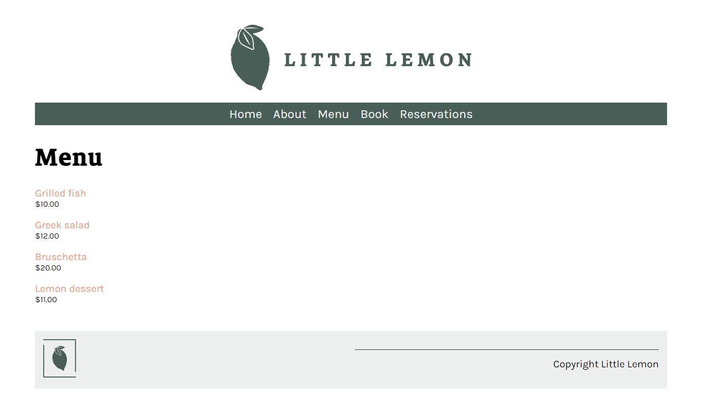

# Screenshots:





# RestaurantSite

RestaurantSite is a web application developed using the Django Web Framework. It serves as a platform for a restaurant to showcase its menu, allow customers to make reservations, and store booking data in a database.

## Features

- **Menu Page**: Display the menu items offered by the restaurant.
- **Menu Item Page**: Provide detailed information about each menu item.
- **Responsive Design**: Ensures compatibility across all devices, allowing customers to access the site from desktops, laptops, tablets, and smartphones.
- **Booking Page**: Enable customers to make reservations directly through the website, with booking data stored in a database and details can be seen on Reservations page in JSON.

## Technologies Used

- **Django Web Framework**: Used to develop the backend logic and serve web pages.
- **DTL (Django Template Language)**: Bridged the gap between Python and HTML5, similar to Jinja 2, for dynamic content rendering.
- **HTML5/CSS3**: Used to create the structure and style the web pages.
- **Shell Commands**: Utilized shell commands to interact with the Django ORM (Object-Relational Mapping) and store booking data in the database.

## Installation

To run the RestaurantSite locally, follow these steps:

1. Clone the repository:

    ```bash
    git clone https://github.com/your_username/RestaurantSite.git
    ```

2. Navigate to the project directory:

    ```bash
    cd RestaurantSite
    ```


3. Install Pipenv (if you haven't already):

    ```bash
    pip install pipenv
    ```

4. Install dependencies using Pipenv:

    ```bash
    pipenv install
    ```

5. Activate the Pipenv shell:

    ```bash
    pipenv shell
    ```


6. Run the development server:

    ```bash
    python manage.py runserver
    ```

7. Access the website in your browser at [http://localhost:8000](http://localhost:8000).

## Contributing

Contributions to RestaurantSite are welcome! If you would like to contribute to the project, please fork the repository, make your changes, and submit a pull request.

## Contact

For questions or feedback regarding RestaurantSite, please contact at [shailendrapal840@gmail.com](mailto:shailendrapal840@gmail.com).
